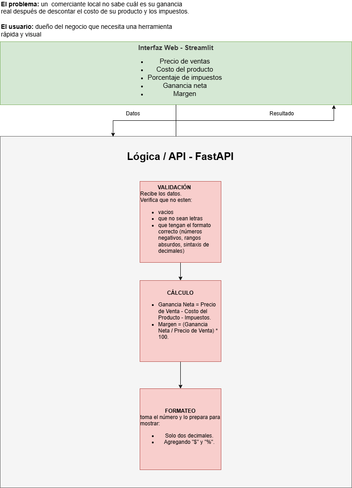

# Calculadora de Rentabilidad (Proyecto de Arquitectura Profesional)

[Prueba la aplicación en vivo aquí](https://calculadorarentabilidad-k8esktq2vjj8epopw2nces.streamlit.app/)

## El Problema
En muchos comercios locales y negocios familiares, el cálculo de los márgenes de ganancia y rentabilidad suele realizarse de forma manual o en planillas desactualizadas. Esto no solo consume valiosas horas de trabajo a la semana, sino que aumenta el riesgo de cometer errores en la fijación de precios frente a la variación de costos. 

## La Solución
Desarrollé una aplicación web interactiva que automatiza este proceso. El usuario simplemente ingresa sus variables (costos fijos, variables y precio de venta esperado) y el motor matemático devuelve instantáneamente el margen de ganancia neto. Esto permite tomar decisiones comerciales en segundos, con una interfaz amigable.

## Arquitectura Técnica y Flujo de Trabajo
Para replicar de forma idéntica cómo se trabaja en un entorno corporativo real, la premisa técnica fue separar por completo la lógica de negocio de la interfaz gráfica. El proyecto implementa las siguientes herramientas:

* Diagramado Lógico: Conceptualización del viaje de la información y la interacción de los nodos utilizando herramientas de flujo (Draw.io/Excalidraw) antes de codificar.
* Backend (Motor Matemático): Desarrollo de una API robusta utilizando FastAPI para aislar el procesamiento de los datos.
* Despliegue del Backend: Alojamiento independiente del servidor lógico en Hugging Face Spaces.
* Frontend (Interfaz de Usuario): Construcción de una vista gráfica interactiva mediante Streamlit.
* Despliegue del Frontend: Alojamiento en Streamlit Cloud consumiendo los datos directamente desde la API alojada en la nube mediante peticiones JSON.
* Control de Versiones y Repositorio: Trazabilidad del código en la nube utilizando Git y GitHub.

## Aprendizajes del Proyecto
Este desarrollo permitió consolidar una arquitectura de servicios separados que se comunican entre sí de forma asíncrona en la nube [8, 13]. El valor principal radica en la aplicación del ciclo de vida completo del producto: desde el versionado del código hasta el despliegue de componentes independientes en internet para que cualquier usuario final pueda consumirlos sin depender de un entorno de desarrollo local.